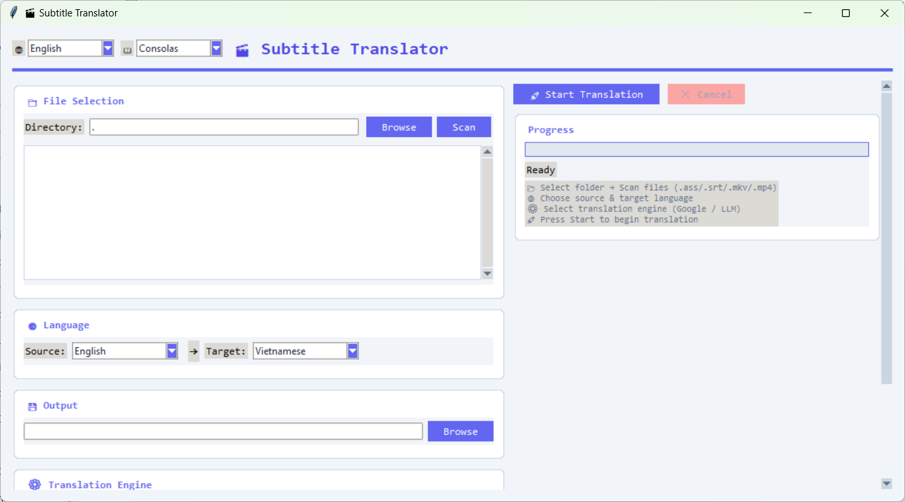

# 🎬 Subtitle Translator

Công cụ dịch phụ đề `.ass` / `.srt` tự động — hỗ trợ Google Dịch và các engine LLM (OpenAI, DeepSeek).  
Kèm tool ghép phụ đề vào file video (`.mp4` / `.mkv`).  
Giao diện đồ họa (GUI) đa ngôn ngữ: 🇬🇧 English, 🇻🇳 Tiếng Việt, 🇨🇳 中文, 🇯🇵 日本語, 🇰🇷 한국어.

---

## ✨ Tính năng

- Dịch phụ đề `.ass` và `.srt` qua **Google Translate** hoặc **LLM (AI)**
- Chọn **Style** ASS để chỉ dịch các dòng thuộc kiểu mong muốn
- Trích xuất phụ đề từ file video (`.mkv` / `.mp4`)
- Giao diện **đa ngôn ngữ** (En / Vi / 中文 / 日本語 / 한국어)
- Theme hiện đại, bo góc, dễ sử dụng
- Tool CLI riêng để **ghép phụ đề vào video** (Mux)

---

## 📦 Yêu cầu

- **Python 3.8+** ([tải tại python.org](https://python.org))
- **ffmpeg + ffprobe** (có trong PATH) — dùng để trích xuất & ghép phụ đề
- **MKVToolNix** (khuyến nghị) — ghép phụ đề ASS vào MKV không lỗi timing

## 🚀 Cài đặt

```bash
# Clone repo
git clone https://github.com/Bkhangg/Subtitle_Translator_by_google.git
cd Subtitle_Translator_by_google

# Cài thư viện
pip install -r requirements.txt
```

## ▶️ Cách chạy

**GUI** (khuyên dùng):
```bash
python subtitle_translator_gui.py
```

**CLI — Dịch phụ đề**:
```bash
python Subtitle_Translator.py
```

**CLI — Ghép phụ đề vào video** (không dịch):
```bash
python Mux_Subtitle.py
```

## 🖥️ Hướng dẫn sử dụng GUI

1. **Chọn thư mục** chứa file phụ đề → nhấn **Scan**
2. **Chọn file** từ danh sách (hoặc chọn video để trích xuất phụ đề)
3. **Chọn ngôn ngữ nguồn và đích**
4. **Chọn engine** dịch:
   - **Google Dịch**: dùng ngay, không cần cấu hình
   - **LLM (AI)**: cần nhập API Key (OpenAI / DeepSeek / tương thích OpenAI)
5. Nhấn **🚀 Start Translation**
6. Theo dõi tiến trình ở cột phải

> Để ghép phụ đề đã dịch vào video, dùng riêng: `python Mux_Subtitle.py`

## 🧩 Cấu trúc project

```
├── subtitle_translator_gui.py     # Giao diện đồ họa (GUI)
├── Subtitle_Translator.py         # Dịch phụ đề — dòng lệnh (CLI)
├── Mux_Subtitle.py                # Ghép phụ đề vào video (CLI)
├── requirements.txt               # Thư viện Python cần thiết
├── screenshots/                   # Ảnh minh họa
│   ├── python_poqiwX0XHZ.png
│   └── WindowsTerminal_iNt0DTeF8E.png
└── README.md
```

## 📸 Ảnh minh họa

  
*Giao diện GUI chính*

  
*Quá trình dịch bằng CLI*

## 📄 Giấy phép

MIT
