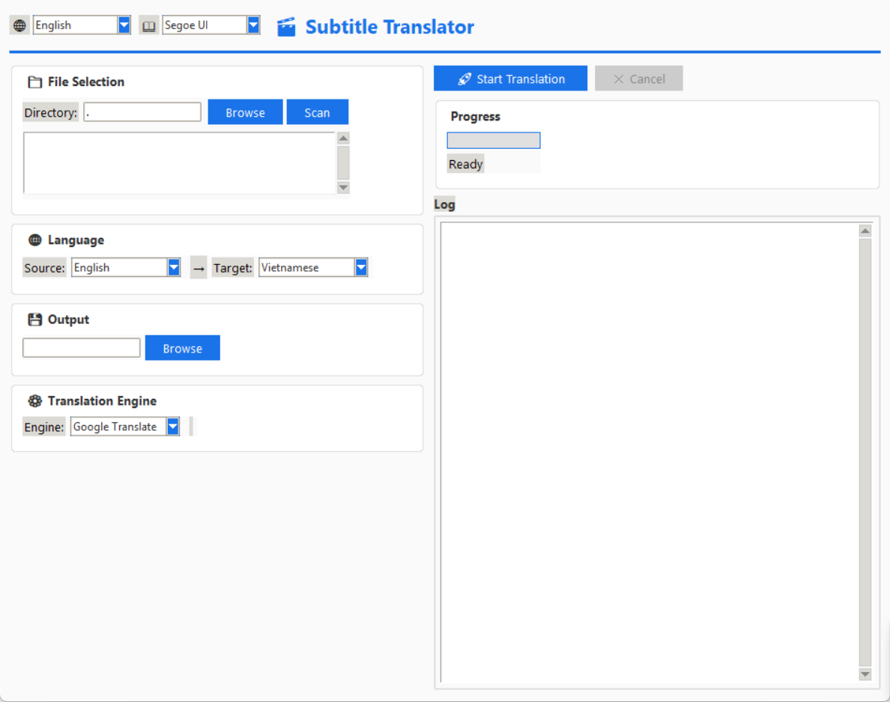
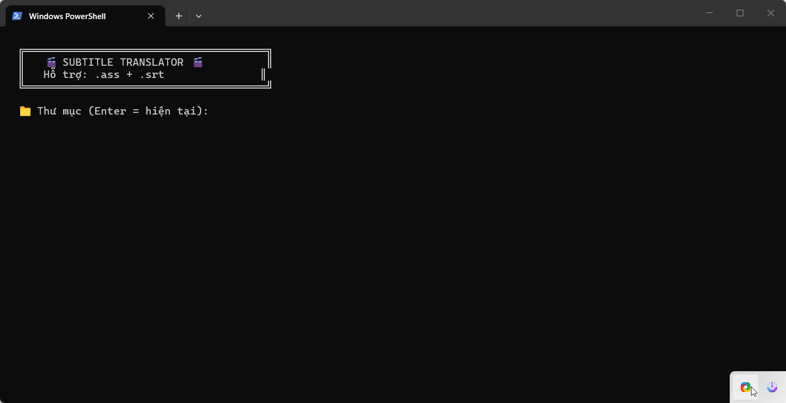

# 🎬 Subtitle Translator

Công cụ dịch phụ đề tự động hỗ trợ nhiều ngôn ngữ giao diện và nhiều engine dịch thuật.

## Tính năng

- **Dịch phụ đề** `.ass` và `.srt` qua Google Dịch hoặc LLM (AI)
- **Giao diện đa ngôn ngữ**: English, Tiếng Việt, 中文, 日本語, 한국어
- **Chọn style ASS** để dịch theo từng kiểu
- **Theme hiện đại** bo góc, màu xanh accent
- **Hỗ trợ nhiều engine**: Google Translate, OpenAI, DeepSeek, API tương thích OpenAI

## Yêu cầu

- **Python 3.8+** (tải tại [python.org](https://python.org))
- Các thư viện Python (xem bên dưới)

## Cài đặt

### 1. Cài thư viện cần thiết

Mở **Terminal / Command Prompt** và chạy:

```bash
pip install googletrans==4.0.0rc1
```

### 2. (Tuỳ chọn) Cài thư viện cho chế độ LLM (AI)

Nếu bạn muốn dùng OpenAI hoặc DeepSeek để dịch:

```bash
pip install openai
```

### 3. Kiểm tra cài đặt

```bash
python -c "import googletrans; print('OK')"
```

## Cách chạy

### Chạy giao diện GUI (khuyên dùng)

```bash
python subtitle_translator_gui.py
```

### Chạy dòng lệnh (CLI)

```bash
python Subtitle_Translator.py
```

## Hướng dẫn sử dụng GUI

1. **Chọn thư mục** chứa file phụ đề → nhấn **Scan**
2. **Chọn file** từ danh sách
3. **Chọn ngôn ngữ nguồn và đích**
4. **Chọn engine** dịch:
   - **Google Dịch**: dùng ngay, không cần cấu hình
   - **LLM (AI)**: cần nhập API Key (OpenAI / DeepSeek / tương thích)
5. Nhấn **🚀 Start Translation**
6. Theo dõi tiến trình ở cột phải

## Ảnh minh họa



*Giao diện GUI chính của Subtitle Translator*



*Quá trình dịch phụ đề bằng CLI*

## Cấu trúc file

```
├── subtitle_translator_gui.py    # Giao diện đồ hoạ (GUI)
├── Subtitle_Translator.py        # Giao diện dòng lệnh (CLI)
├── test_keys.py                  # Kiểm tra API key
├── api.txt                       # Danh sách API key (mẫu)
└── README.md                     # File hướng dẫn này
```
