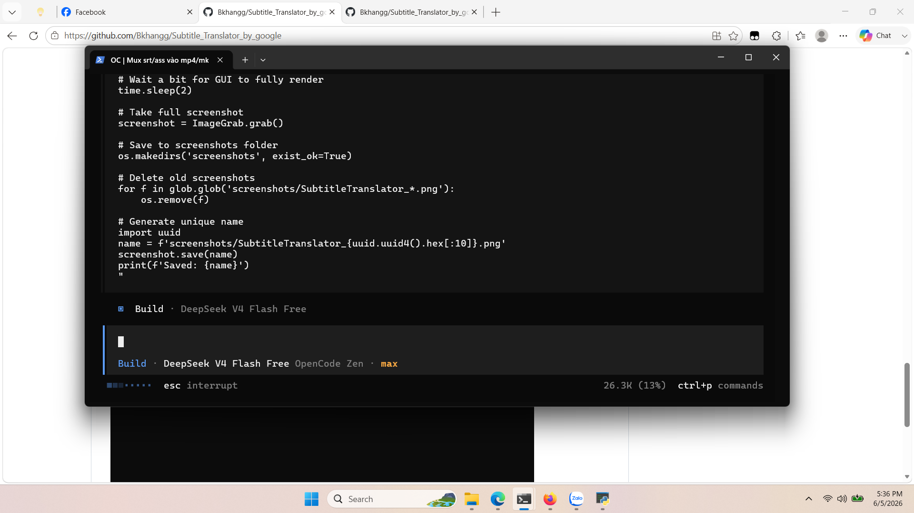
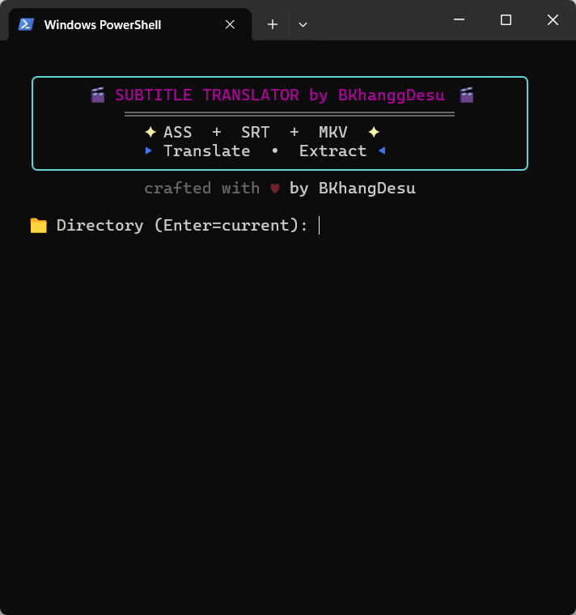

# 🎬 Subtitle Translator

Công cụ dịch phụ đề `.ass` / `.srt` tự động — hỗ trợ Google Dịch và các engine LLM (OpenAI, DeepSeek).  
Kèm tool ghép phụ đề vào file video (`.mp4` / `.mkv`).  
Giao diện đồ họa (GUI) đa ngôn ngữ: 🇬🇧 English, 🇻🇳 Tiếng Việt, 🇨🇳 中文, 🇯🇵 日本語, 🇰🇷 한국어.

---

## ✨ Tính năng

- Dịch phụ đề `.ass` và `.srt` qua **Google Translate** hoặc **LLM (AI)**
- Chọn **Style** ASS để chỉ dịch các dòng thuộc kiểu mong muốn
- Trích xuất phụ đề từ file video (`.mkv` / `.mp4`)
- Giao diện **đa ngôn ngữ** (En / Vi / 中文 / 日本語 / 한국어)
- Theme hiện đại, bo góc, dễ sử dụng
- **Ghép phụ đề vào video** (Mux) — tích hợp ngay trong CLI và GUI
- **Batch Mux** — ghép trực tiếp từ GUI mà không cần dịch
- **Batch Translate** — tự động dịch & ghép tất cả video trong thư mục (CLI & GUI)
- Build sẵn file **EXE** cho Windows (không cần cài Python)
- Tên file output tự động gồm **tên ngôn ngữ + mã code** (VD: `filename_Vietnamese_vi.srt`)
- Metadata phụ đề khi mux phản ánh đúng **ngôn ngữ đích** (VD: mux tiếng Nhật → title "Japanese subtitle", language `ja`)

---

## 📦 Yêu cầu

- **Python 3.8+** ([tải tại python.org](https://python.org))
- **ffmpeg + ffprobe** (có trong PATH) — dùng để trích xuất & ghép phụ đề
- **MKVToolNix** (khuyến nghị) — ghép phụ đề ASS vào MKV không lỗi timing

## 🚀 Cài đặt

```bash
# Clone repo
git clone https://github.com/Bkhangg/Subtitle_Translator_by_google.git
cd Subtitle_Translator_by_google

# Cài thư viện
pip install -r requirements.txt
```

## ▶️ Cách chạy

**GUI** (khuyên dùng):
```bash
python subtitle_translator_gui.py
```

Hoặc dùng file EXE có sẵn (Windows):
> Tải `SubtitleTranslator.exe` từ [Releases](https://github.com/Bkhangg/Subtitle_Translator_by_google/releases)

**CLI — Main Menu** (tích hợp cả Translate và Mux):
```bash
python Subtitle_Translator.py
```
Khi chạy sẽ hiện menu:
```
  1. Translate         — Dịch phụ đề ASS/SRT
  2. Mux               — Ghép phụ đề vào video MP4/MKV
  3. Batch Translate   — Dịch & ghép tất cả video trong thư mục
```

**CLI — Ghép phụ đề vào video** (độc lập):
```bash
python Mux_Subtitle.py
```

## 🖥️ Hướng dẫn sử dụng GUI

1. **Chọn thư mục** chứa file phụ đề → nhấn **Scan**
2. **Chọn file** từ danh sách (hoặc chọn video để trích xuất phụ đề)
3. **Chọn ngôn ngữ nguồn và đích**
4. **Chọn engine** dịch:
   - **Google Dịch**: dùng ngay, không cần cấu hình
   - **LLM (AI)**: cần nhập API Key (OpenAI / DeepSeek / tương thích OpenAI)
5. Nhấn **🚀 Start Translation**
6. Theo dõi tiến trình ở cột phải
7. Sau khi dịch xong, có thể **tích mux tự động** bằng checkbox ☑️
8. Hoặc dùng **Batch Mux** để ghép bất kỳ video + phụ đề nào
9. **Batch Translate** (GUI) — nhấn ▶ Start ở card 🎬 Batch Translate để tự động trích xuất, dịch và ghép tất cả video trong thư mục

## 🧩 Cấu trúc project

```
├── subtitle_translator_gui.py     # Giao diện đồ họa (GUI)
├── Subtitle_Translator.py         # Dịch phụ đề — dòng lệnh (CLI) + Mux menu
├── Mux_Subtitle.py                # Module ghép phụ đề vào video
├── requirements.txt               # Thư viện Python cần thiết
├── SubtitleTranslator.spec        # PyInstaller config build EXE
├── screenshots/                   # Ảnh minh họa
│   ├── SubtitleTranslator_c50b8616f4.png
│   └── WindowsTerminal_RFyplyHJRw.png
└── README.md
```

## 🔧 Build EXE

```bash
pip install pyinstaller
python -m PyInstaller SubtitleTranslator.spec
```
Kết quả: `dist/SubtitleTranslator.exe`

## 📸 Ảnh minh họa

  
*Giao diện GUI chính*

  
*Quá trình dịch bằng CLI*

## 📄 Giấy phép

MIT
